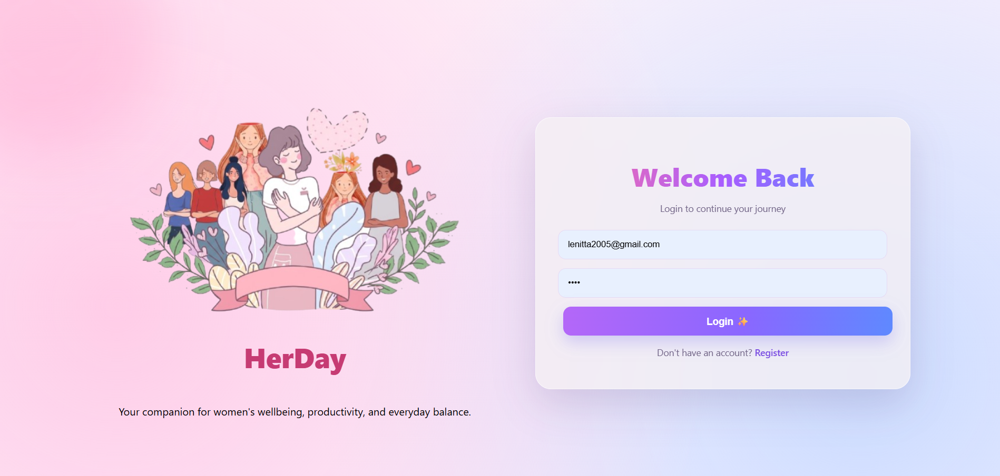
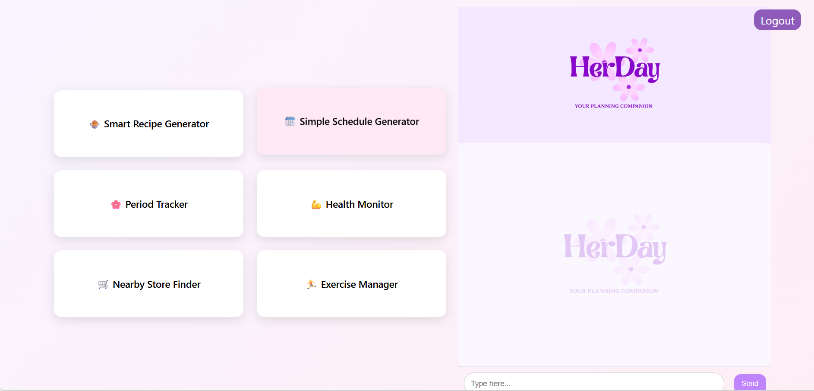
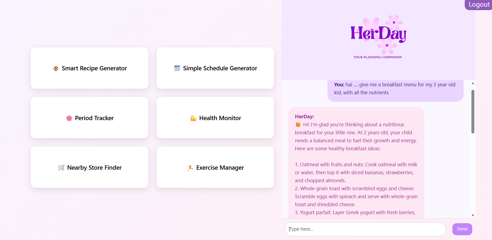
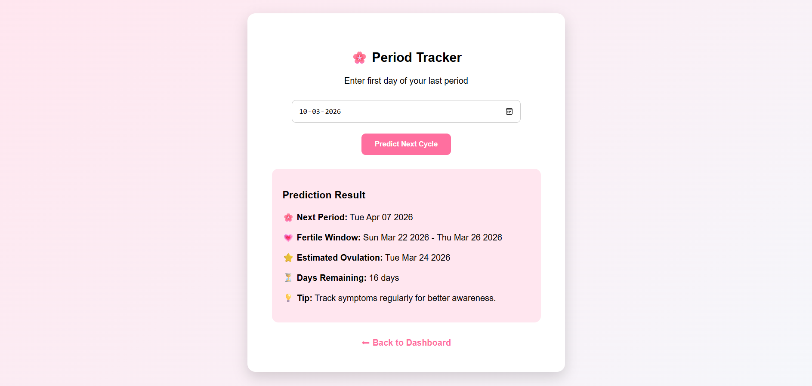
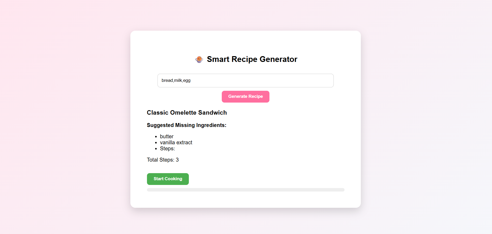
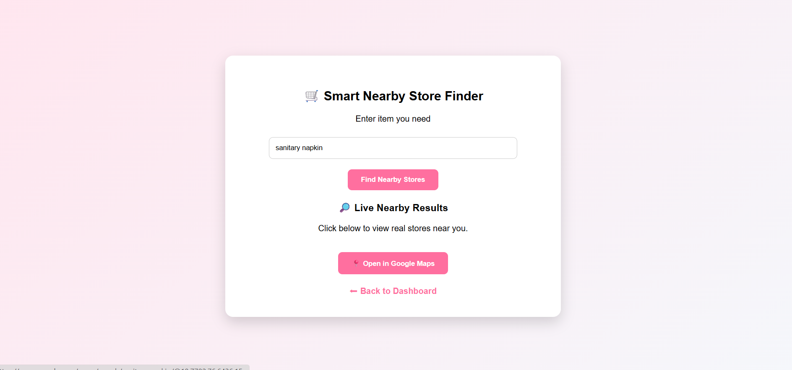

# HerDay – Your Planning Companion

##  About the Project

HerDay is a web based lifestyle and productivity assistant that is designed to support women in managing their everyday activities, health and emotional well being. Its main feature is a women centric AI chatbot, and also supports other features like recipe generator, health monitor, exercise manager, period
tracker, nearby store finder, and schedule generator.

---

##  Features

*  Women centric AI Chatbot
*  Period tracking
*  Schedule generator
*  Exercise manager
*  Smart Recipe Generator
*  Basic Health Monitor
*  Nearby Store Finder
*  User login & registration
*  Secure authentication using password hashing

---

##  Technologies Used

* Frontend: HTML, CSS, JavaScript
* Backend: Python, Flask
* Database: SQLite
* API: Groq API, Google Maps

---

##  Project Structure

* `app.py` – Main backend application
* `models.py` – Database models
* HTML files – UI pages
* `style.css` – Styling
* `script.js` – Functionality

---

## Sample screenshots

*  
*  
* 
* 
* 
* 

  ---

## How to Run the Project

### 1. Clone the repository

```bash
git clone https://github.com/lenittaelvis-blip/herday.git
```

### 2. Navigate to the project folder

```bash
cd herday
```

### 3. Install required dependencies

```bash
pip install -r requirements.txt
```

### 4. Create a `.env` file

Add the following environment variables:

```env
SECRET_KEY=your_secret_key_here
GROQ_API_KEY=your_groq_api_key_here
```

### 5. Run the Flask application

```bash
python app.py
```

### 6. Open the project in your browser

```txt
http://127.0.0.1:5000
```

---

##  Author

Lenitta Elvis 
